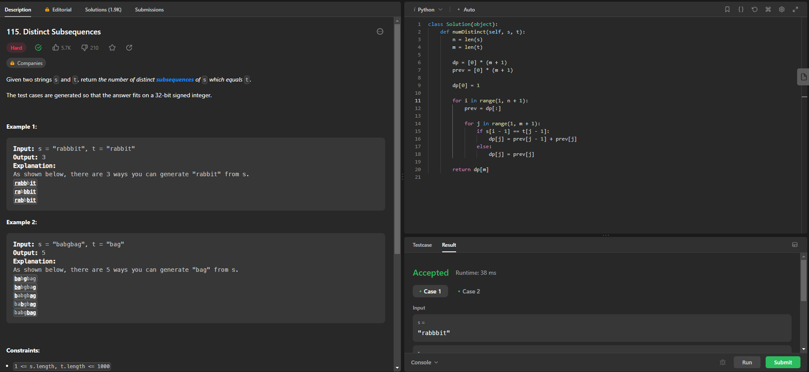
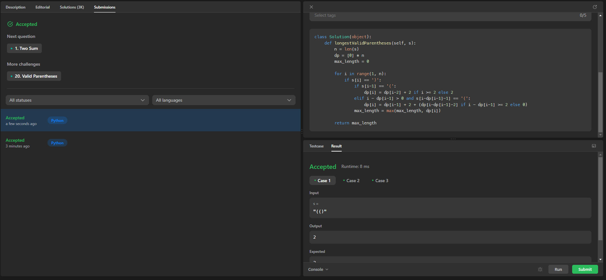
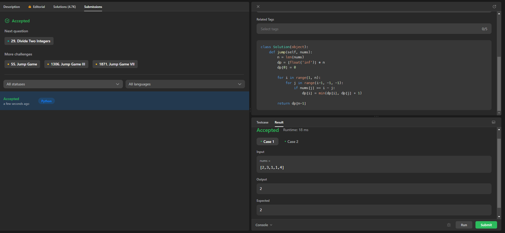
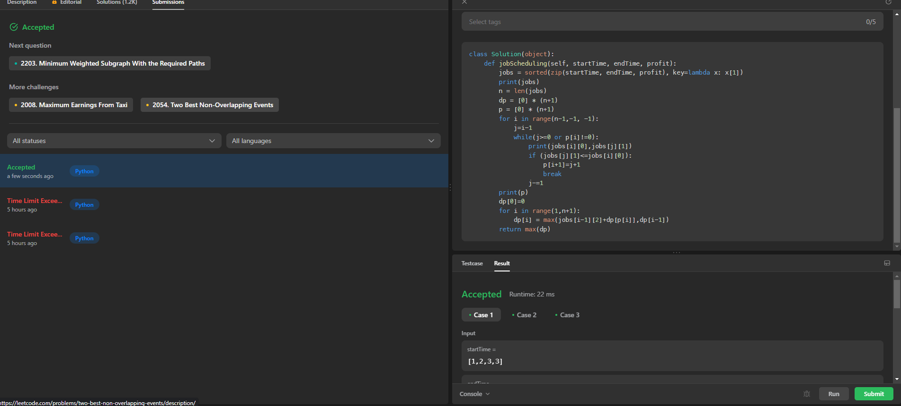

# Programação Dinâmica - Exercícios Do LeetCode

**Número da Lista**: 26 
**Conteúdo da Disciplina**: Programação Dinãmica 

## Alunos
|Matrícula | Aluno |
| -- | -- |
| 19/0042532  |  Felipe Alef Pereira Rodrigues |
| 18/0145509  |  Lucas Ramon Alves De Oliveira |

## Sobre 
Exercícios diversos do Leetcode

## Screenshots

### Exercicio 1 (Difícil) - [Distinct Subsequences](https://leetcode.com/problems/distinct-subsequences/)
[Código](Exercicios/DistinctSubsequences.py) 

### Exercicio 2 (Médio) - [Coin Change II](https://leetcode.com/problems/coin-change-ii)
[Código](Exercicios/CoinChange.py) 

### Exercicio 3 (Difícil) - [Longest Valid Parentheses](https://leetcode.com/problems/longest-valid-parentheses)
[Código](Exercicios/LongestParentheses.py) 

### Exercicio 4 (Média) - [Jump Game](https://leetcode.com/problems/jump-game-ii)
[Código](Exercicios/JumpGame.py) 

### Exercicio 5 (Difícil) - [Maximum Profit in Job Scheduling](https://leetcode.com/problems/maximum-profit-in-job-scheduling/)
[Código](Exercicios/JobScheduling.py) 

## Instalação 
**Linguagem**: Python 

Para rodar o código do prolema localmente, basta ter o python instalado.

## Uso 

### Passo 1: Copiar o código
Entre na pasta do exercício específico, clique no arquivo `.py` do código de interesse e copie-o.

### Passo 2: Entrar na página do exercício
Entre na página LeetCode do exercício específico para que o código seja executado. O link para a página pode ser encontrado neste README na sessão "Sobre".

### Passo 3: Alterar linguagem
Altere a linguagem utilizada como resolução para `Python3` (a opção fica logo acima do editor de código).

### Passo 4: Colar o código
Ainda na página do LeetCode, cole o código copiado no editor de código.

### Passo 5: Rodar o código
Abaixo do editor de código, clique em `Run` para executar o código.

### Passo 6: Verificar resultados
Assim que executado, verifique os resultados e se o código resolve o exercício.

