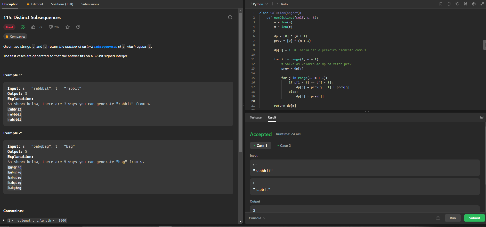
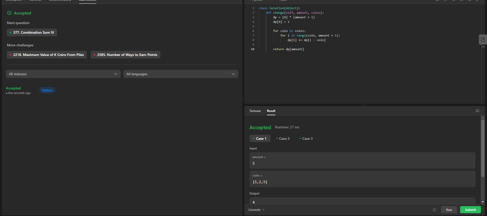

# Programação Dinâmica - Exercícios Do LeetCode

**Número da Lista**: 26 
**Conteúdo da Disciplina**: Programação Dinãmica 

## Alunos
|Matrícula | Aluno |
| -- | -- |
| 19/0042532  |  Felipe Alef Pereira Rodrigues |
| 18/0145509  |  Lucas Ramon Alves De Oliveira |

## Sobre 
Exercícios diversos do Leetcode

## Screenshots

### Exercicio 1 (Difícil) - [Distinct Subsequences](https://leetcode.com/problems/distinct-subsequences/)
[Código](Exercicios/DistinctSubsequences.py) 

### Exercicio 2 (Médio) - [Coin Change II](https://leetcode.com/problems/coin-change-ii)
[Código](Exercicios/DistinctSubsequences.py) 

## Instalação 
**Linguagem**: Python 

## Uso 
Explique como usar seu projeto caso haja algum passo a passo após o comando de execução.

